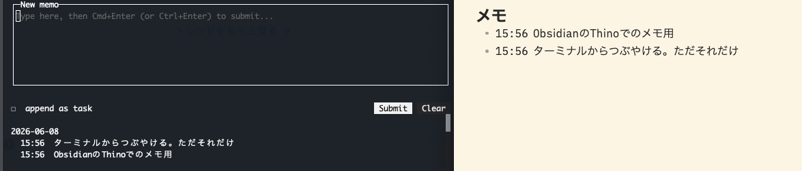

# thino-tui

**Obsidian の [Thino](https://github.com/Quorafind/Obsidian-Thino) メモをターミナルから読み書きする TUI。**

[Thino](https://github.com/Quorafind/Obsidian-Thino) プラグインを使っている Obsidian ユーザー向けの軽量 TUI。Obsidian を開かなくても、ターミナルから直接メモを追記したり、最近のメモを一覧できる。データは Vault の Markdown に直接書き込まれるので、Obsidian 側の Thino パネルと完全に同じものを編集している感覚で使える。



> 左の TUI で投稿したメモは、Obsidian の Thino パネル（右）にもそのまま現れる。両者は同じ Vault の Markdown を読み書きしているだけ。

Built with **Bun + TypeScript + [OpenTUI](https://github.com/anomalyco/opentui) + [hascii-ui](https://ui.hascii.sh)**.

## Features

- 複数行のメモを Thino スタイル（時刻ヘッダ + インデント継続）で追記
- 過去 N 日分のメモを一覧表示、行表示 / カード表示の切替に対応
- タスク形式 (`- [ ]`) でのメモ投稿
- マウス（クリック / ホイール）+ キーボード両対応
- 非 DAILY モード（JOURNAL / MULTI / CANVAS / FILE）は自動で read-only

## Installation

[Bun](https://bun.sh/) が必要です。`~/.bun/bin` が `$PATH` に通っていることも確認してください。

```bash
git clone https://github.com/taichiyam/thino-tui.git
cd thino-tui
bun install
bun link
```

これで `thino-tui` コマンドがどこからでも使えるようになります。ビルド不要で TypeScript ソースを直接実行します。アンインストールはこのディレクトリで `bun unlink`。

> **補足: バイナリ配置版**
> ブランチ切り替えの影響を受けたくない場合は、コンパイル済みバイナリを `~/.bun/bin/` に配置できます:
> ```bash
> bun run install:local
> ```
> 更新したいときに再度実行してください。

## Usage

```bash
# 設定ゼロで起動 — Obsidian で 1 度でも vault を開いていれば自動検出されます
thino-tui

# 別の vault を一時的に指定したいとき
thino-tui --vault /path/to/another-vault

# 表示期間を変更
thino-tui --days 14

# ソース直接実行（インストール不要）
bun run src/index.tsx
```

### フラグ

| フラグ | デフォルト | 説明 |
|---|---|---|
| `--vault PATH` | 自動検出 → `$OBSIDIAN_VAULT` | Obsidian Vault のパス。指定しなければ Obsidian の `obsidian.json` から自動検出されます |
| `--days N` | `7` | 過去何日分のメモを一覧するか |
| `--read-only` | off | 入力欄を強制的に無効化 |
| `--help` / `-h` | — | ヘルプを表示 |

### キーバインド

起動時はテキストエリアにフォーカスがあり、その下に最近のメモが読み取り専用で並びます。

| キー | 動作 |
|---|---|
| `Cmd+Enter` / `Ctrl+Enter` | メモを投稿 |
| `Enter` | 改行（複数行メモ） |
| `Tab` | タスク形式 (`- [ ]`) のオン/オフ |
| `Ctrl+R` | メモ一覧を再読み込み |
| `Ctrl+Q` | 終了 |

read-only モード（Thino mode が DAILY 以外、または `--read-only`）では入力欄が消え、`r` / `q` が単独キーとして動作します。

> `Cmd+Enter` は Kitty キーボードプロトコルで Cmd を `super` として通知してくれるターミナル（Ghostty / WezTerm / iTerm2 with CSI u など）が必要です。それ以外では `Ctrl+Enter` を使ってください。

## Configuration

### Vault パス

**設定は必要ありません。** Obsidian で 1 度でも vault を開いていれば、thino-tui は Obsidian 自身の vault リスト (`obsidian.json`) を読んで自動で解決します。

優先順:

1. **`--vault PATH`** フラグ（一時オーバーライド、最優先）
2. **`obsidian.json` 自動検出**（デフォルト、設定不要）
3. **環境変数 `OBSIDIAN_VAULT`**（後方互換）

`obsidian.json` のパスは OS 別:

| OS | パス |
|---|---|
| macOS | `~/Library/Application Support/obsidian/obsidian.json` |
| Linux | `~/.config/obsidian/obsidian.json` |
| Windows | `%APPDATA%\obsidian\obsidian.json` |

複数 vault が登録されている場合は、Obsidian で現在開いている vault (`open: true`) を優先し、無ければ最終起動 (`ts` が最大のもの) を採用します。別の vault に切り替えたい場合は `--vault` を使ってください。

### その他

時刻は JST (UTC+09:00) 固定です。

## Notes

現状の MVP の制約:

- Thino mode は **DAILY のみ書き込み可能**（他モードは read-only で閲覧）
- デイリーノートのファイル名形式は `YYYY-MM-DD` 固定
- ファイル変更の自動監視はなし（`Ctrl+R` で再読み込み）
- 編集 / 削除 / 検索は未実装

レイヤー構成や Thino のデータ形式の詳細は [`docs/architecture.md`](docs/architecture.md) を参照。

## Development

```bash
bun install
bun test            # lib/ のユニットテスト + screen テスト
bun run typecheck   # tsc --noEmit
bun start           # alias for `bun run src/index.tsx`
bun run build       # `dist/thino-tui` に単一バイナリを書き出す
```

### ディレクトリ構成

```
src/
├── index.tsx                # エントリ。CLI フラグパース + OpenTUI render
├── app.tsx                  # ルート。Context Provider + 画面ルーター
├── screens/                 # 画面（HomeScreen）
├── components/              # Memo 行 / Card / DateHeader / StatusBar / hascii-ui ラッパ
└── lib/
    ├── obsidian-config.ts   # vault パス解決（obsidian.json）
    ├── thino-config.ts      # Thino プラグインの動作モード読み取り
    ├── daily-notes-config.ts# デイリーノートのファイル名形式
    ├── memo.ts              # Memo 型 + 行パース
    └── memo-repository.ts   # listMemos / appendMemo（ユースケース層）
tests/
├── fixtures/                # 最小 vault + obsidian-config のサンプル JSON
├── lib/                     # 各 *-config / memo* の単体テスト
└── home-screen.test.tsx     # 画面結合テスト
```

レイヤーの責務とデータの流れは [`docs/architecture.md`](docs/architecture.md) を参照。

### 配布バイナリ

`bun build --compile` で単一バイナリを作成できます（OpenTUI の native dylib も自動同梱、約 68MB）。

```bash
bun run build                # dist/thino-tui に書き出し
./dist/thino-tui --help      # 単独実行
bun run install:local        # ~/.bun/bin/thino-tui にバイナリ配置（ブランチ非依存運用）
```

クロスコンパイル / CI 配布 / Homebrew tap は [#4](https://github.com/taichiyam/thino-tui/issues/4) で追跡しています。

## Contributing

バグ報告・機能リクエスト・PR は歓迎です。

- バグや要望は [Issues](https://github.com/taichiyam/thino-tui/issues) に立ててください
- 開発の方向性は [Roadmap (#4)](https://github.com/taichiyam/thino-tui/issues/4) を参照
- PR を送る場合は、まず issue で方針合意してから取りかかるとスムーズです
- コミット前に `bun test` と `bun run typecheck` が緑であることを確認してください

## References

- [Thino plugin](https://github.com/Quorafind/Obsidian-Thino) — Obsidian 用のメモプラグイン本体
- [`thn` CLI](https://github.com/ignission/thn) — シンプルな先行 Rust 製 CLI。データモデル参照元
- [OpenTUI](https://github.com/anomalyco/opentui) — TUI ランタイム
- [hascii-ui](https://ui.hascii.sh) — TUI コンポーネントレジストリ

## License

[MIT](LICENSE) © taichiyam
